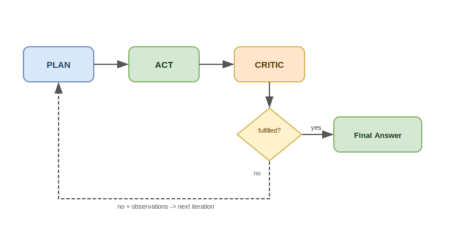

# ToteN

ToteN is a package for building **autonomous agents**. It provides the core building blocks that let you run a goal-driven reasoning loop powered by an AI model and a set of tools you define.

## Table of Contents

- [Core Concepts](#core-concepts)
  - [The Agentic Loop](#the-agentic-loop)
    - [Plan](#plan)
    - [Act](#act)
    - [Critic](#critic)
    - [Loop termination](#loop-termination)
  - [Tools](#tools)
  - [Context](#context)
- [What Can You Build With It?](#what-can-you-build-with-it)
- [Language-Specific Documentation](#language-specific-documentation)

## Core Concepts

### The Agentic Loop

The central concept in ToteN is the **Agentic Loop**: a repeating cycle that drives an agent toward a goal by combining planning, action, and critical evaluation in every iteration.

Each iteration of the loop goes through three phases:

#### Plan

The **Planner** decides what the agent should do next. It receives:

- The original **goal** provided by the caller.
- The list of **available tools** and their descriptions.
- **Observations** accumulated from previous iterations (feedback from the Critic).

It returns a structured instruction for the Act phase.

#### Act

The **Actor** carries out the Planner's instruction. It can call any of the **tools** that were registered with the loop. It returns the result of its action as text.

#### Critic

The **Critic** evaluates whether the Actor's output fully satisfies the original goal. It returns one of two outcomes:

- **Fulfilled** — the goal is met. The Critic provides the final answer and the loop exits.
- **Not fulfilled** — the goal is not yet met. The Critic provides concrete observations that are fed into the next iteration.

#### Loop termination

The loop runs for up to a configurable maximum number of iterations. If the Critic marks the goal as fulfilled before that limit is reached, the loop exits early with the final answer. If the limit is reached without fulfilment, the loop returns a timeout result along with the last critic observation.

### Tools

Tools are the actions the agent can take. You define them yourself and register them with the loop. A tool has a name, a description (which the Planner reads to decide when to use it), and an implementation that performs the actual work — calling an API, reading a database, running a calculation, etc.

### Context

In addition to a goal, you can pass optional **context** — a list of background strings that the agent can use across all phases of every iteration to stay grounded in relevant information.

## What Can You Build With It?

The Agentic Loop is a general-purpose building block. Some examples of what you can build:

- **Information retrieval agents** — agents that query APIs, databases, or knowledge bases and synthesise the results into a coherent answer.
- **Multi-step task automation** — agents that break a complex goal into sequential steps and execute them one by one.
- **Research assistants** — agents that iteratively gather information, evaluate completeness, and dig deeper until they are confident in an answer.
- **Workflow orchestrators** — agents that coordinate calls to multiple external systems to complete a business process.

## Language-Specific Documentation

- [Node (Typescript)](node/README.md)
